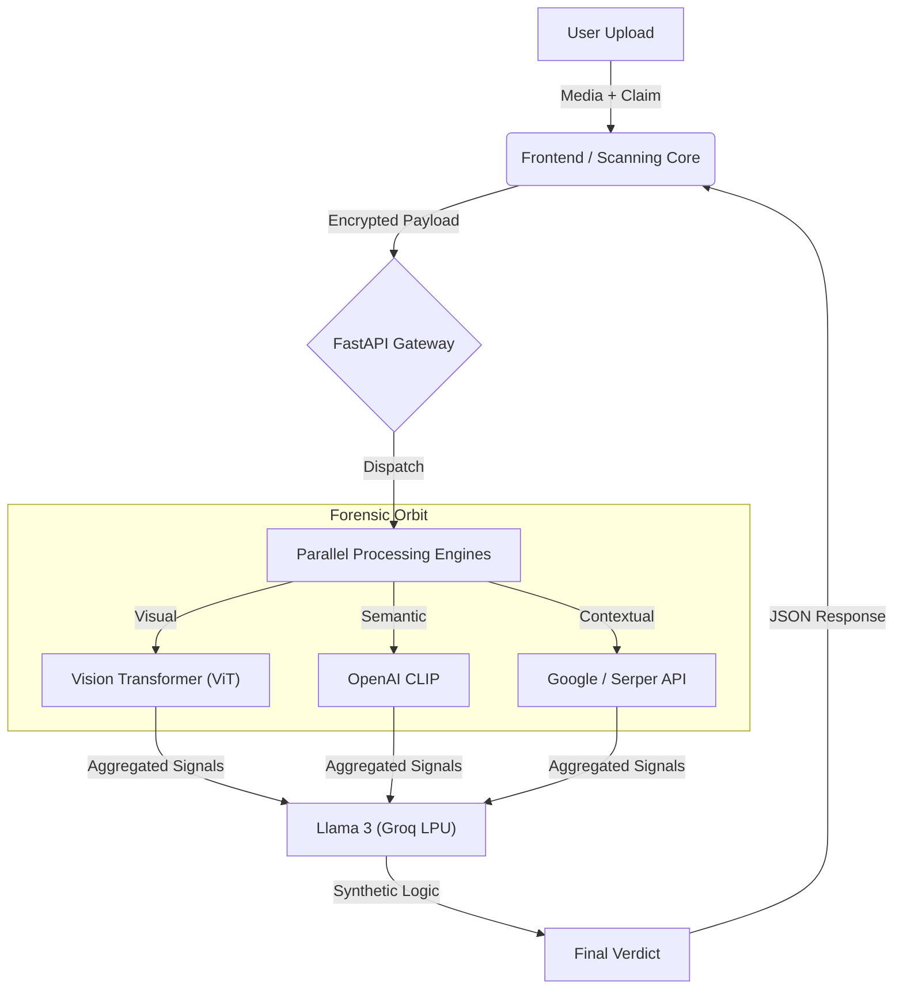

<div align="center">

# 🛡️ S H I E L D · A I 
### *Frictionless Verification for the Post-Truth Era*


<br>

***"Truth, elevated."***

</div>

---

## 🌌 Abstract: The Forensic Orbit

In a digital expanse saturated with synthetic noise, **ShieldAI** does not merely "check" facts; it establishes a **Forensic Orbit** around your data. By fusing spectral analysis, semantic embeddings, and real-time context retrieval, we lift the burden of verification from the user. 

We act as a **transparent layer of truth**, intercepting misinformation with surgical precision before it impacts improved decision-making. We don't just tell you *if* it's fake; we visualize *why*, using a weightless, frictionless interface designed for instantaneous clarity.

---

## 🏗️ The Floating Tech Stack

Our architecture is designed to be as lightweight as it is powerful. We discard heavy monolithic structures for a modular, clean-energy propulsion system.

| Layer | Component | Function |
| :--- | :--- | :--- |
| **🧠 Core Nucleus** | **Groq + Llama 3** | The cognitive reactor. Generates plain-English forensic verdicts with near-zero latency using LPUs (Language Processing Units). |
| **🛡️ Semantic Shield** | **OpenAI CLIP** | The meaning guard. Measures the gravitational pull (similarity) between the caption and the visual evidence. |
| **🧬 Digital DNA** | **Vision Transformers (ViT)** | The microscopic lens. Identifying compression artifacts and pixel inconsistencies using State-of-the-Art Deep Learning (`dima806/deepfake_vs_real`). |
| **🕸️ Context Web** | **Serper API** | The grounding anchor. Scours the live web to cross-reference claims against verified global events. |

---

## 📐 System Architecture: The Forensic Flow



---

## 📊 Scientific Validation

We don't just guess; we prove. ShieldAI includes a built-in **Evaluation Dashboard** running real-time robust analytics on the `Cosmos` dataset.

| Metric | Visualization | Purpose |
| :--- | :--- | :--- |
| **ROC AUC** | 📈 Line Curve | Demonstrates high sensitivity (Types I error) vs fallout (Type II error) trade-offs. |
| **Confusion Matrix** | 🔲 2x2 Grid | Transparently displays True Positives vs False Negatives. |
| **Robustness** | 🛡️ Stability Bar | Measures prediction consistency under Gaussian noise attacks. |
| **Temporal Pulse** | 💓 Heartbeat Graph | Visualizes deepfake probability spikes over time (1 FPS). |

---

## ⚡ Visual Benchmarks

ShieldAI operates at the speed of thought. By leveraging Groq's LPU inference, we achieve what standard GPU clusters cannot: instant transparency.

| Metric | Traditional Forensic Tools | **ShieldAI (Antigravity)** |
| :--- | :--- | :--- |
| **Inference Time** | 🐢 5.0s - 12.0s | **🚀 0.8s - 1.2s** |
| **User Friction** | 🛑 High (Manual uploads, complex logs) | **✨ Non-Existent (Drag & Drop, Auto-Scan)** |
| **Cognitive Load** | 🤯 Heavy (Forensic jargon) | **☁️ Light ("Real" vs "Safe", Radar Charts)** |
| **Multimodality** | 🖼️ Image Only | **🧠 Image + Text + Context + Search** |

---

## 🖱️ The Antigravity UI: HCI Principles

We adhere to a "Surgical White" design philosophy. Every pixel justifies its existence.

*   **1. Visibility of System Status (Scanning Overlay)**
    *   *The Problem:* AI processing feels like a black box.
    *   *The Solution:* An animated **"Laser Scan"** provides immediate, visceral feedback that the sensors are active, bridging the gap between input and insight.

*   **2. Recognition Rather Than Recall (History Sidebar)**
    *   *The Problem:* Users forget previous results in multi-stage investigations.
    *   *The Solution:* A persistent, translucent **History Dock** allows effortless toggling between cases, reducing working memory strain.

*   **3. Aesthetic & Minimalist Design (Verdict Cards)**
    *   *The Problem:* Forensic data is overwhelming.
    *   *The Solution:* We distill complexity into **Verdict Cards**. Color-coded badges (Green/Red), simple Radar Charts, and plain-English summaries ensure the truth is instantly recognizable.

---

## 🚀 Lifting the System (Installation)

Prepare for liftoff. Ensure you have `Python 3.9+` and `Node.js` installed.

### 1. Ignite the Backend
The engines of detection.
```bash
cd misinfo-shield
python -m venv venv
# Windows
.\venv\Scripts\activate
# Mac/Linux
# source venv/bin/activate

pip install -r requirements.txt
uvicorn api:app --reload
```

### 2. Launch the Frontend
The window to the orbit.
```bash
cd frontend
npm install
npm run dev
```

### 3. Environment Variables
Fuel the system. Create a `.env` file:
```env
GROQ_API_KEY=your_key_here
SERPER_API_KEY=your_key_here
```

---

## 🔮 Future Trajectory

*   **Video Frame Interpolation Analysis**: Extending the scan to 60fps video streams.
*   **Browser Extension**: Bringing the Shield directly to the social feed.
*   **Decentralized Verification**: Storing immutable verdicts on-chain.

---

<div align="center">

*Built with precision for the Echelon.*
<br>
**ShieldAI** © 2026

</div>
